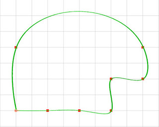
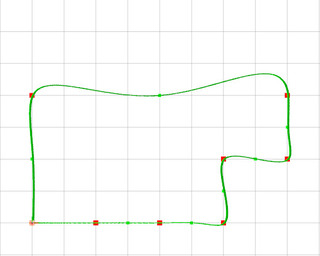
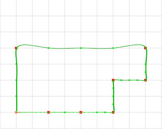
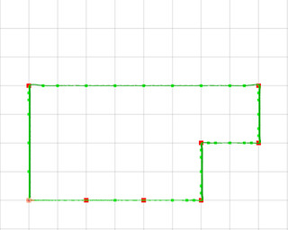
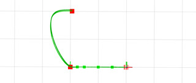
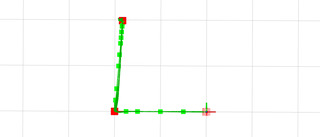

# MRS UAV Trajectory Generation [](https://travis-ci.com/ctu-mrs/mrs_uav_trajectory_generation)


## General description

This package provides a method for generation a time-parametrized [trajectory](https://ctu-mrs.github.io/mrs_msgs/msg/TrajectoryReference.html) out of a [path](https://ctu-mrs.github.io/mrs_msgs/msg/Path.html) (a sequence of waypoints).
The resulting trajectory satisfies the current dynamics constraints of the UAV **and** completes the path in **minimum possible time**.
The **maximum deviation** of the resulting trajectory from the supplied path is a user-configurable parameter.


We built upon of the work of [ethz-asl/mav_trajectory_generation](https://github.com/ethz-asl/mav_trajectory_generation).
The main differences are:

* This package provides ROS node that is meant to be used within the [MRS UAV System](https://github.com/ctu-mrs/mrs_uav_system). However, it can be easily modified for other purposes. 
* This ROS node subscribes to the current control reference of the UAV and current allowed dynamics constraints. The resulting trajectory satisfies the constraints and starts from the current reference state.
* Improved _Mellinger's_ time allocation: only the polynomial segments that violate constraints are _stretched_, instead of the whole trajectory.
* Purely Euclidean `max_speed` time estimate is used for initializing segment times. It provides lower bound, which is good since the constraints are met by prolonging the segment times (not shortening them).
* Iterrative segment subsectioning is added to satisfy maximum distance from the original segmented waypoint path.
* Removed dependency on the [glog](https://github.com/google/glog) library and the ETH glog [wrapper](https://github.com/ethz-asl/glog_catkin).
* Removed dependency on [catkin_simple](https://github.com/catkin/catkin_simple).
* Removed dependency on the _yaml_cpp_ library.
* Removed dependency on the custom-built [nlopt](https://nlopt.readthedocs.io/en/latest/) ETH [wrapper](https://github.com/ethz-asl/nlopt) and substituded it with the available ROS variant (`sudo apt install ros-melodic-nlopt`).
* Added dependency on [mrs_lib](https://github.com/ctu-mrs/mrs_lib) (just for convenience).
* Added dependency on [mrs_msgs](https://github.com/ctu-mrs/mrs_msgs) (for compatibility with the [MRS UAV System](https://github.com/ctu-mrs/mrs_uav_system)).

## Configuration and use

### ROS interface

Input: [service](https://ctu-mrs.github.io/mrs_msgs/srv/PathSrv.html) and [topic](https://ctu-mrs.github.io/mrs_msgs/msg/Path.html) address:
```
/uav*/trajectory_generation/path
```

Output: by default, the node calls [/uav*/control_manager/trajectory_reference](https://ctu-mrs.github.io/mrs_msgs/srv/TrajectoryReferenceSrv.html) service to the [ControlManager](https://github.com/ctu-mrs/mrs_uav_managers).

### Segment subsectioning

The node allows to check and correct for the maximum allowed deviation from a segmented path supplied by the user.
If enabled, the user-supplied segments will be subdivided to satisfy the maximum distance constraint.
The [config](https://github.com/ctu-mrs/mrs_uav_trajectory_generation/blob/master/config/default.yaml) file provides the options to enable/disable this feature, to set the maximum allowed deviations, and the number of iterations.
Each iteration allows the algorithm to subdivide any segments if the resulting trajectory violates the distance constraint within the segment.
6 iterations is enough to fall within 0.1 m tolerance.
The first segment can be optionally excluded from this constraint.

```yaml
check_trajectory_deviation:
  enabled: true
  max_deviation: 0.1 # [m]
  max_iterations: 6 # [-]
  first_segment: true
```

|                               |                               |
|-------------------------------|-------------------------------|
| without subsectioning         | 1 iteration                   |
|  |  |
| 2 iterations                  | 3 iterations                  |
|  |  |
| 4 iterations                  | 5 iterations                  |
|  |  |

### Initial condition \& First segment subsectioning

Subsectioning of the first segment is optional.
The choice revolves around the initial conditions.
When the UAV is in motion, the subsectioning of the first segment can create constraints that might be difficult to satisfy.
On the other hand, when the UAV is stationary, the first segment might need to be subsectioned to minimize the deviation from the first waypoint, especially if the first waypoint is relatively far away.

The following images show the two situations with a dynamic initial condition.

|                                   |                                   |
|-----------------------------------|-----------------------------------|
| the 1st segment unconstrained     | the 1st segment subsectioned      |
|  |  |

### Dynamics constraints

The dynamics constrints are automatically obtained from the [ControlManager](https://github.com/ctu-mrs/mrs_uav_managers) (`/uav*/control_manager/current_constraints`).
Beware, this method does not distinguish between horizontal and vertical constraints, as it is with the rest of the MRS UAV system.
Therefore, only the **horizontal** constraints values are pull out of [ControlManager](https://github.com/ctu-mrs/mrs_uav_managers).
For arbitrarilly structured paths set the horizontal and vertical constraints equal in the [ConstraintManager](https://github.com/ctu-mrs/mrs_uav_managers).

The input service/topic allows to override the maximum velocity and acceleration constraint.
If overriden, the smaller values (between the user-overriden and the supplied by the [ControlManager](https://github.com/ctu-mrs/mrs_uav_managers).) will be used.

## Dependencies

* `sudo apt install ros-melodic-mav-msgs ros-melodic-nlopt`
* [mrs_lib](https://github.com/ctu-mrs/mrs_lib)
* [mrs_msgs](https://github.com/ctu-mrs/mrs_msgs)

## Ackwnoledgments

This package based upon [ethz-asl/mav_trajectory_generation](https://github.com/ethz-asl/mav_trajectory_generation).
Please, cite the original publications:

C. Richter, A. Bry, and N. Roy, “**Polynomial trajectory planning for aggressive quadrotor flight in dense indoor environments,**” in *International Journal of Robotics Research*, Springer, 2016.
```
@incollection{richter2016polynomial,
  title={Polynomial trajectory planning for aggressive quadrotor flight in dense indoor environments},
  author={Richter, Charles and Bry, Adam and Roy, Nicholas},
  booktitle={Robotics Research},
  pages={649--666},
  year={2016},
  publisher={Springer}
}
```
Michael Burri, Helen Oleynikova, Markus Achtelik, and Roland Siegwart, “**Real-Time Visual-Inertial Mapping, Re-localization and Planning Onboard MAVs in Previously Unknown Environments**”. In *IEEE Int. Conf. on Intelligent Robots and Systems* (IROS), September 2015.
```
@inproceedings{burri2015real-time,
  author={Burri, Michael and Oleynikova, Helen and  and Achtelik, Markus W. and Siegwart, Roland},
  booktitle={Intelligent Robots and Systems (IROS 2015), 2015 IEEE/RSJ International Conference on},
  title={Real-Time Visual-Inertial Mapping, Re-localization and Planning Onboard MAVs in Unknown Environments},
  year={2015},
  month={Sept}
}
```
